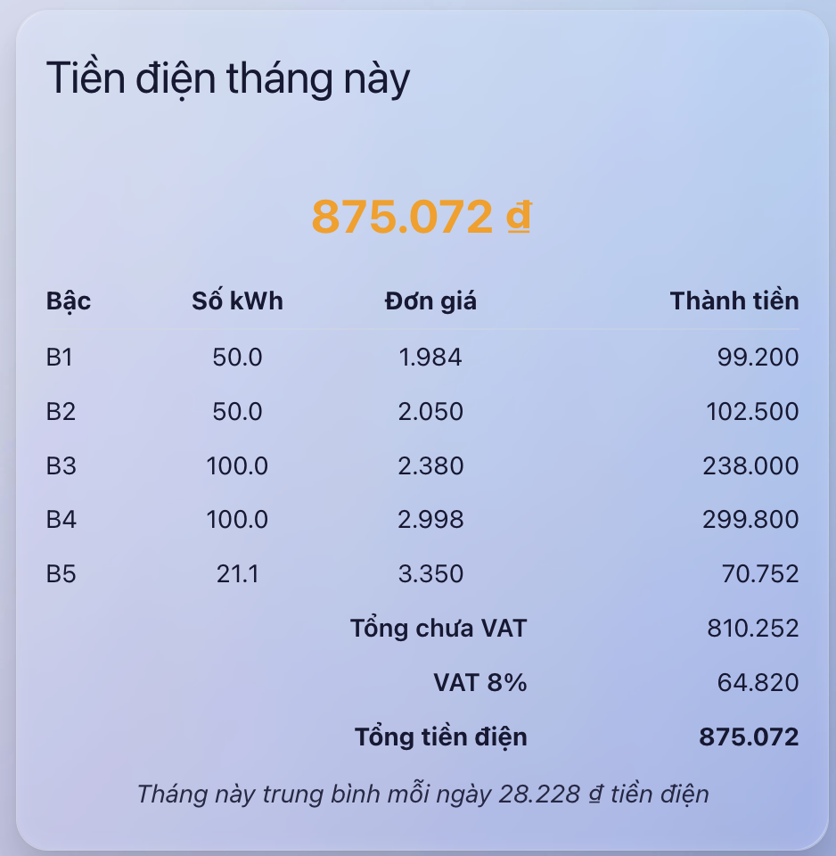

# 🧭 Hóa đơn điện bậc thang

Hiển thị hóa đơn tiền điện của bạn một cách trực quan



## 🔧 Tính năng chính

Chỉ cần 1 con số input vào bất kỳ mà bạn đưa vào sẽ tính giá điện theo bậc thang của EVN
Giá điện được quy định theo bậc tại file evn.json

## ⚙️ Cài đặt

VÀO HACS trên Home assistant -> Thêm kho lưu trữ tùy chỉnh 
```yaml
https://github.com/HoangQuan90/dien-bac-thang-evn
```
Kiểu là bảng điều khiển -> bấm thêm
Sau khi thêm tìm kiếm "Điện Bậc Thang EVN" để tải về

## Tạo file evn.json chứa giá điện

Tiếp theo hãy dùng Addon File Editor truy cập vào đường dẫn 
/homeassistant/www/community/dien-bac-thang-evn/
ở đây bạn tạo 1 file mới tên là evn.json chứa giá điện theo bậc có nội dung như sau
```yaml
{
  "so_bac": 6,
  "b1": { "gia": 1984, "kw": 50 },
  "b2": { "gia": 2050, "kw": 51 },
  "b3": { "gia": 2380, "kw": 101 },
  "b4": { "gia": 2998, "kw": 201 },
  "b5": { "gia": 3350, "kw": 301 },
  "b6": { "gia": 3460 }
}
```

## Code mẫu
```yaml
type: custom:dien-bac-thang-remote-card
entity: sensor.tong_tieu_thu_thang_ct2
name: Tiền điện tháng này
short: false
detail: true
mode: 2

```
# Ủng hộ tôi để có thêm động lực phát triển:
Cảm ơn các bạn

